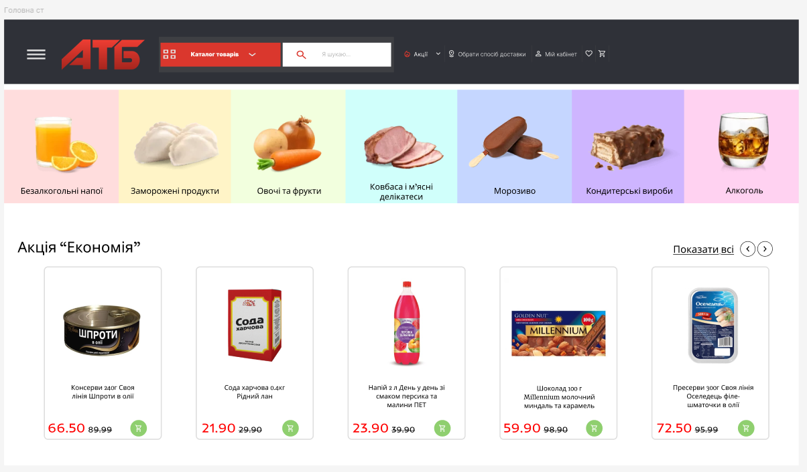
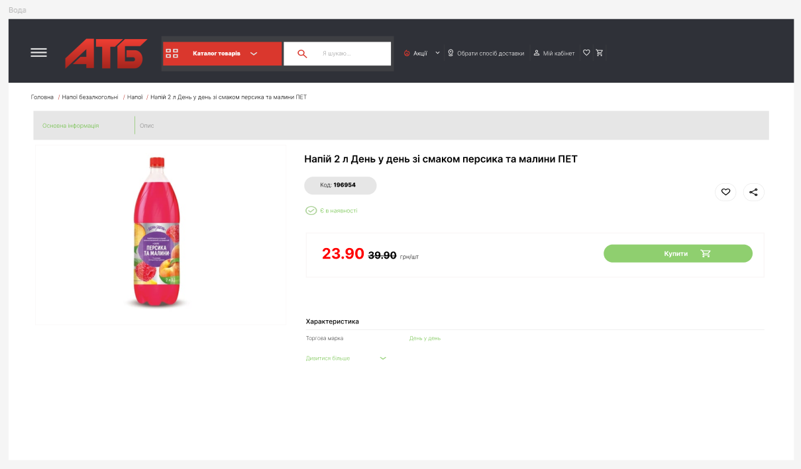
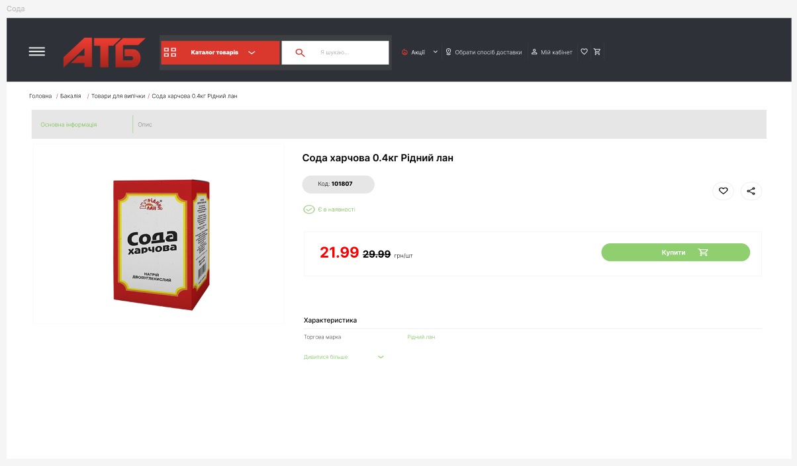
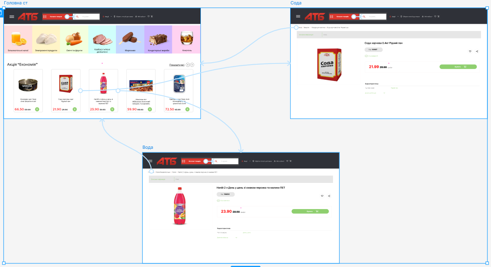

# **ПРАКТИЧНА РОБОТА №12**

## **Тема: Розробка wireframe.**

## **Мета: Cтворити у Figma деталізований вайрфрейм сайту для інтернет-магазину (головна сторінка та 2-3 сторінки товару). Тематику обрати самостійно. Розмір екранів - desktop. Використати інструменти прототипування і зробити клікабельний прототип на основі вайфрейму.**

### Хід роботи:
### 1 Створення сторінок:

#### **1) Cтворюю головну сторінку сайту**

#### **2) Далі створюю першу сторінку товару**

#### **3) Наступний крок це створення 2 сторінки товару**

### 2 Клікабельність інтерфейсу:

#### **1) Прототип:**

#### **2) Перевірка:**
(https://github.com/user-attachments/assets/d0d1880a-f94c-47bc-8109-f92ab7c8773d)

#### **Посилання на роботу:**
[Переглянути проєкт у Figma](https://www.figma.com/design/mGKZ0eTRwqqzlwySVUjBEv/Untitled?node-id=0-1&m=dev&t=WjaAZrTexBoHm4YW-1)

## **ВИСНОВОК:**
У ході виконання практичної роботи було розроблено детальний wireframe інтернет-магазину в середовищі Figma для desktop-версії. Було створено головну сторінку та дві сторінки товару з продуманою структурою елементів інтерфейсу. Також реалізовано клікабельний прототип, що дозволяє перевірити логіку навігації та взаємодії користувача з сайтом.
