# **ПРАКТИЧНА РОБОТА №13**

## **Тема: Дослідження кольорових гармоній та інструментів аналізу кольору в Adobe Color.**

## Мета:
1) Ознайомити студентів із поняттям кольорової гармонії та основними типами гармонії кольорів.
2) Навчити студентів використовувати колірне колесо для побудови палітр за різними принципами гармонії.
3) Ознайомити із можливостями автоматичного виділення кольорових палітр із зображень та створення градієнтів.
4) Навчити перевіряти контрастність кольорових пар відповідно до стандартів доступності (WCAG).
5) Закріпити навички документування та аналізу роботи з кольором у Markdown-форматі у GitHub-репозиторії.

### Хід роботи:
### 1 Створіть палітри для кожного типу гармонії:
У середовищі Adobe Color було обрано базовий колір #3A6EA5 (синьо-блакитний).

#### 1) Analogous
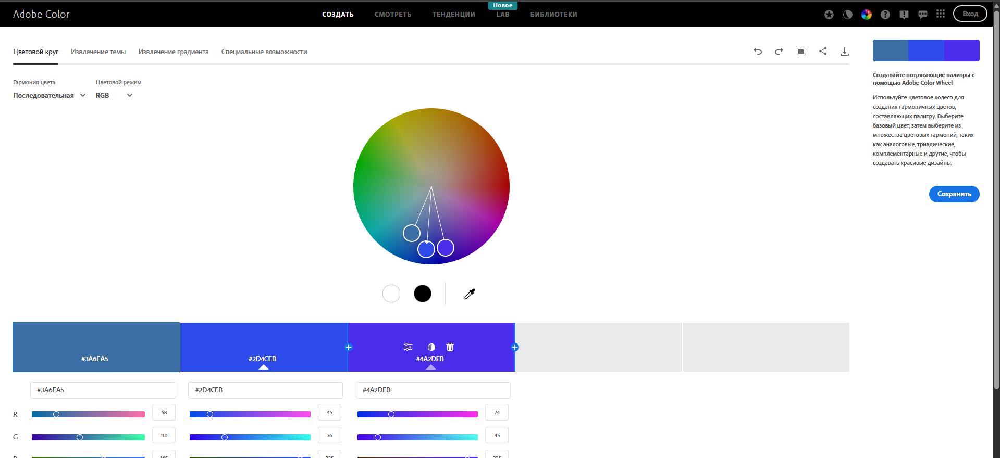
Палітра побудована з кольорів, розташованих поруч на колірному колесі.
Емоційний ефект — спокійний та гармонійний, підходить для фонових елементів інтерфейсу.

#### 2) Monochromaticу
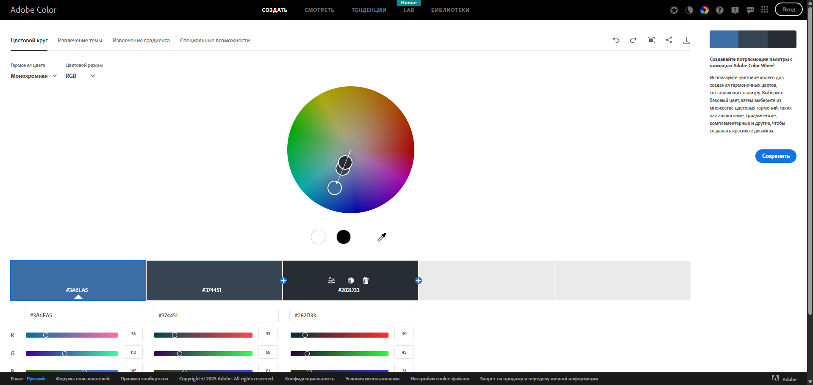
Палітра створена на основі одного кольору з різною яскравістю та насиченістю.
Ефект — мінімалізм та охайний вигляд.

#### ) Triad
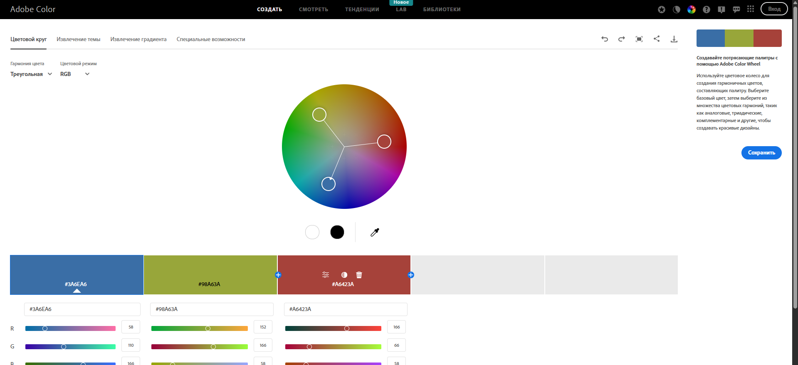
Використано три кольори, рівномірно розташовані на колірному колесі.
Палітра виглядає динамічно та сучасно.

#### 4) Complementary
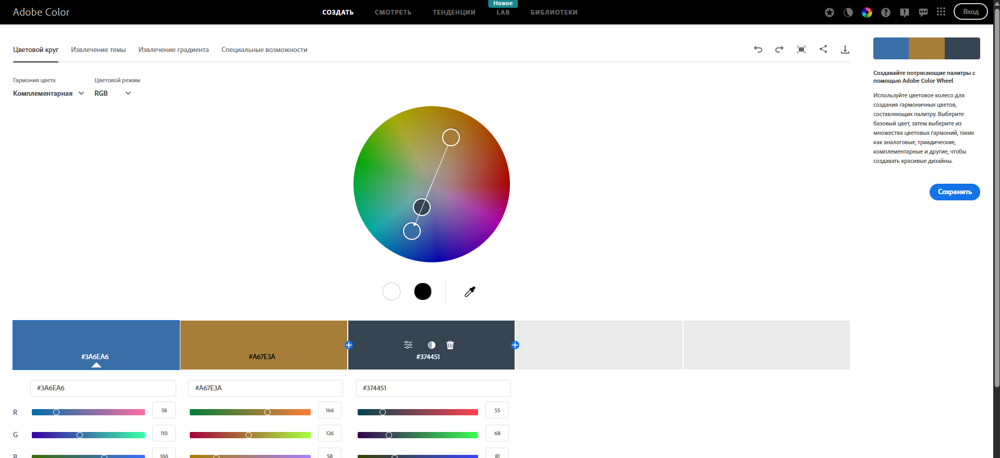
Побудована на протилежних кольорах.
Забезпечує високий контраст і добре підходить для акцентних елементів.

#### 5) Split Complementary
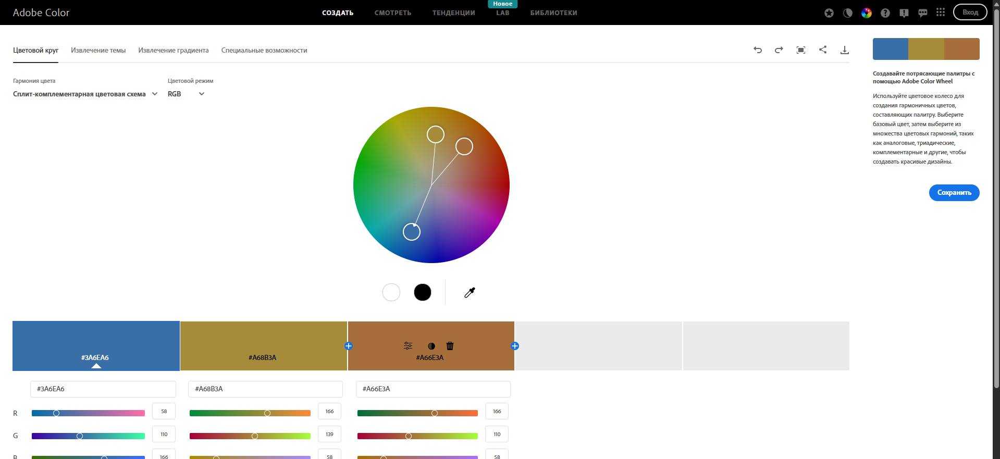
Використано базовий колір та два суміжні до комплементарного.
Контраст менш різкий, але зберігається виразність.

#### 6) Square
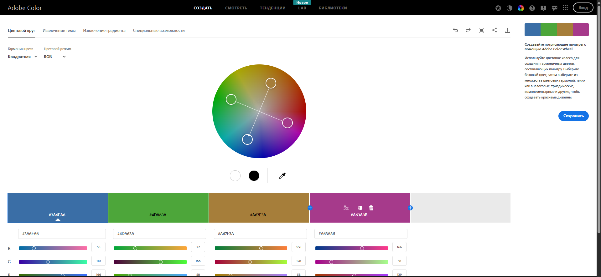
Палітра з чотирьох кольорів, рівномірно розташованих на колірному колесі.
Підходить для креативних та ілюстративних рішень.

#### 7) Custom
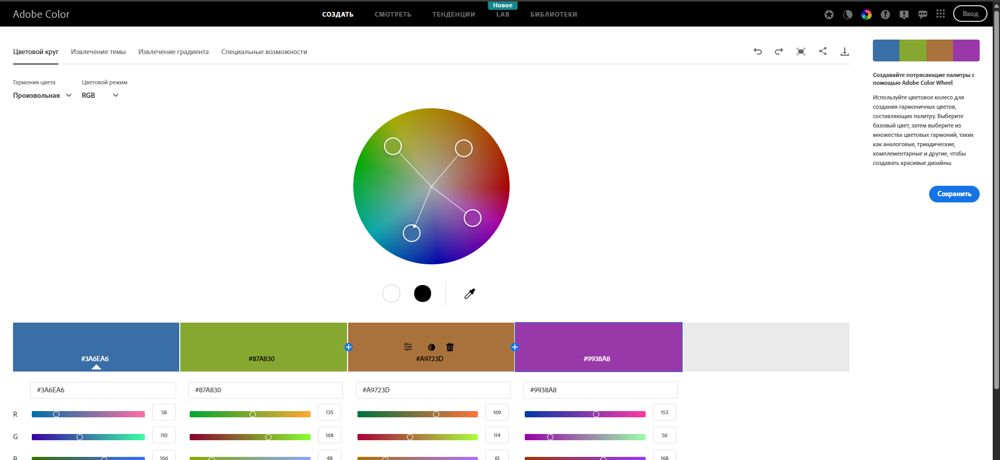
Палітра створена вручну з урахуванням зручності використання в інтерфейсі.
Основу складають холодні відтінки з помірним контрастним акцентом.

### 2 Створіть палітри для кожного типу гармонії:
Створіть палітру у двох варіантах настрою:
Colorful
Muted

#### 1) Colorful:
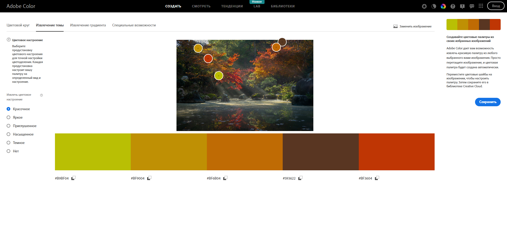
Насичена та яскрава палітра, більше підходить для творчих проєктів.

#### 2) Muted:
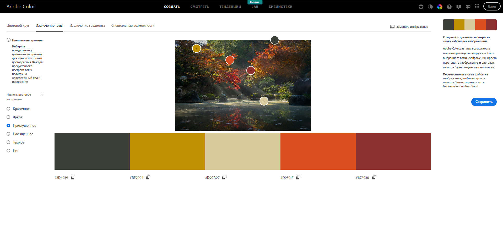
Приглушена палітра, більш комфортна для інтерфейсу застосунку

### 3 Створення Градієнту на Основі Зображення (Extract Gradient):
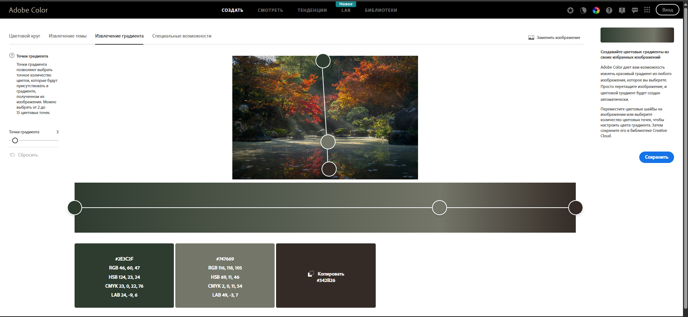
На основі зображення створено градієнт з трьома кольоровими точками.
Градієнт має плавний перехід і може використовуватися як фон.

### 4 Створення Градієнту на Основі Зображення (Extract Gradient):

#### 1) Скоригований варіант (відповідає стандартам)
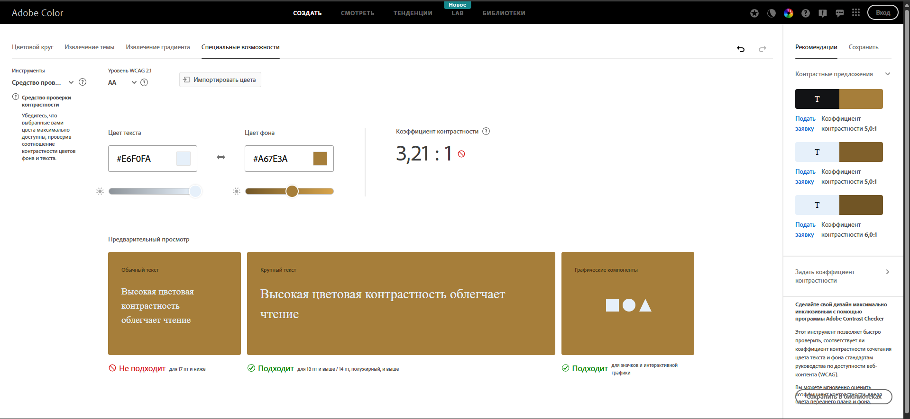
Пара кольорів:
Text color: #E6F0FA
Background color: #A67E3A
Контрастне співвідношення: 3.21 : 1
Результат перевірки:
— Не відповідає вимогам WCAG 2.1 для звичайного тексту
— Підходить лише для великого тексту та графічних елементів

#### 2) Початковий варіант (недостатній контраст)
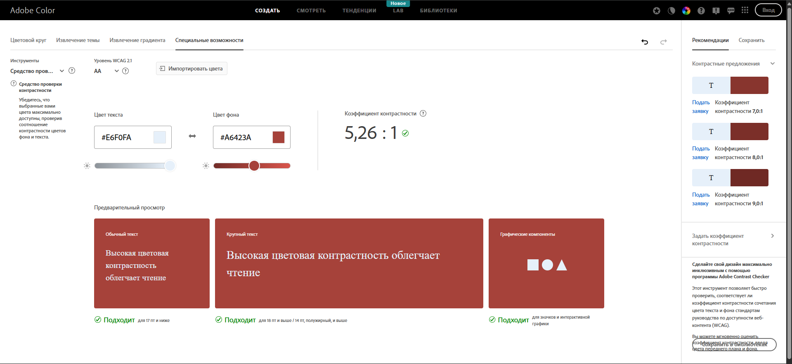
Пара кольорів:
Text color: #E6F0FA
Background color: #A6423A
Контрастне співвідношення: 5.26 : 1
Результат перевірки:
— Відповідає вимогам WCAG 2.1 AA для звичайного тексту
— Відповідає вимогам для великого тексту
— Підходить для графічних та інтерактивних елементів

## ВИСНОВОК:
У ході виконання практичної роботи було досліджено різні типи кольорових гармоній та можливості сервісу Adobe Color. Найбільш придатними для інтерфейсів виявилися монохроматична, аналогічна та комплементарна палітри, оскільки вони забезпечують баланс між естетикою та читабельністю. Аналіз контрастності підтвердив важливість перевірки кольорів відповідно до стандартів доступності.
