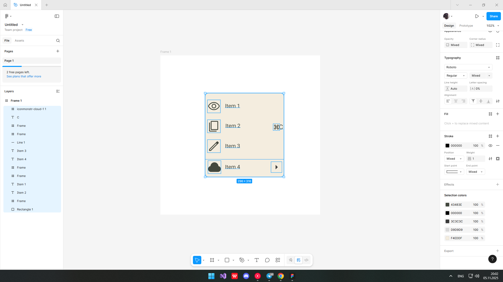
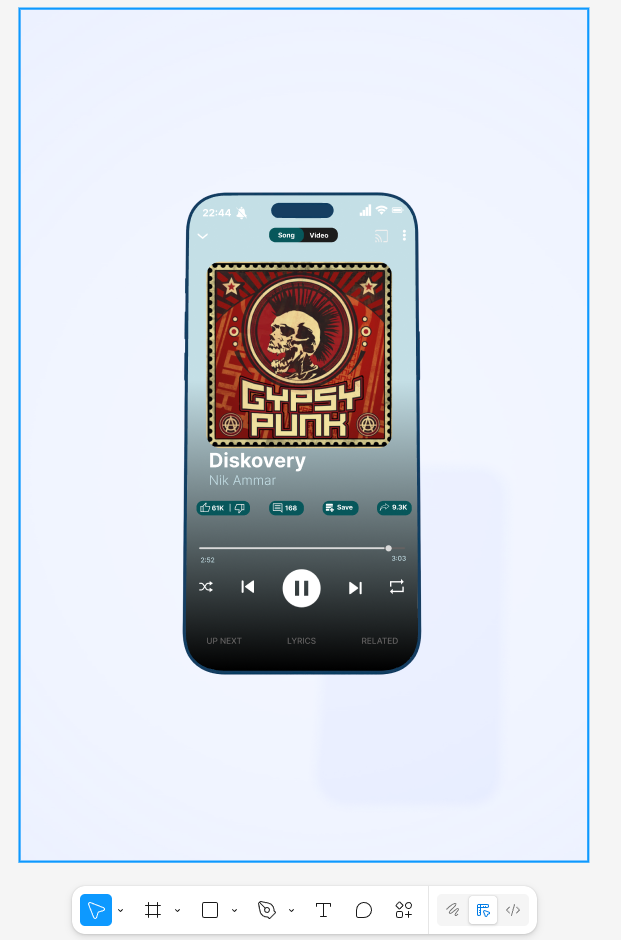

# **ПРАКТИЧНА РОБОТА №4**

## **Тема: Фрейми, групи і секції у Figma**

### Хід роботи:

#### **1. Повторюємо завдання рівня Basic**

#### **Кінцевий результат:**

#### **Посилання на роботу:**
https://www.figma.com/design/Pt7vBmzsRd9xC7jMg2NO0v/Untitled?node-id=0-1&m=dev&t=2Fer3I7mOQwMoQnQ-1

#### **2. Повторюємо завдання рівня Medium**

#### **Кінцевий результат:**

#### **Посилання на роботу:**
https://www.figma.com/design/ACHrgtbS1Zji2Pm39fVRTv/Untitled?node-id=0-1&m=dev&t=6kejuvR6kfhPxSiZ-1

## **ВИСНОВОК:**
У процесі роботи я опанував основи створення структурованих макетів у Figma, навчився ефективно використовувати фрейми, автолейаути та іконки. Виконав завдання рівнів Basic та Medium.
