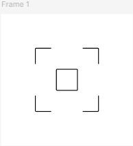
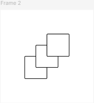
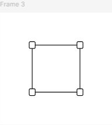
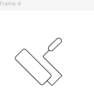
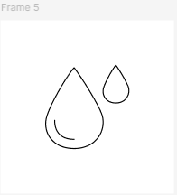

# **ПРАКТИЧНА РОБОТА №5**

## **Тема: Криві Безьє, векторні об'єкти у Figma. Створення векторних значків (іконок)**

### Хід роботи:

#### **Приклад 1 іконки**

#### **Кінцевий результат:**

#### **Приклад 2 іконки**

#### **Кінцевий результат:**

#### **Приклад 3 іконки**

#### **Кінцевий результат:**

#### **Приклад 4 іконки**

#### **Кінцевий результат:**

#### **Приклад 5 іконки**

#### **Кінцевий результат:**

#### **Посилання на роботу:**
https://www.figma.com/design/Dp0dtHBIWoW6kZmI5zn5bO/Untitled?node-id=0-1&p=f&t=mkuQYGnv7rhQq9sB-0

## **ВИСНОВОК:**
Отже, під час виконання цієї практичної роботи я не лише ознайомився з базовими можливостями інструменту Pen Tool у Figma, але й отримав практичні навички його застосування на реальних прикладах. Крім того, я закріпив уміння працювати з кривими та опорними точками завдяки сервісу The Bezier Game, який дозволив у більш ігровій та інтерактивній формі відпрацювати точність та плавність побудови ліній. У результаті я краще зрозумів принципи роботи з векторною графікою та підвищив власну впевненість у використанні цього інструменту в подальших проєктах.
