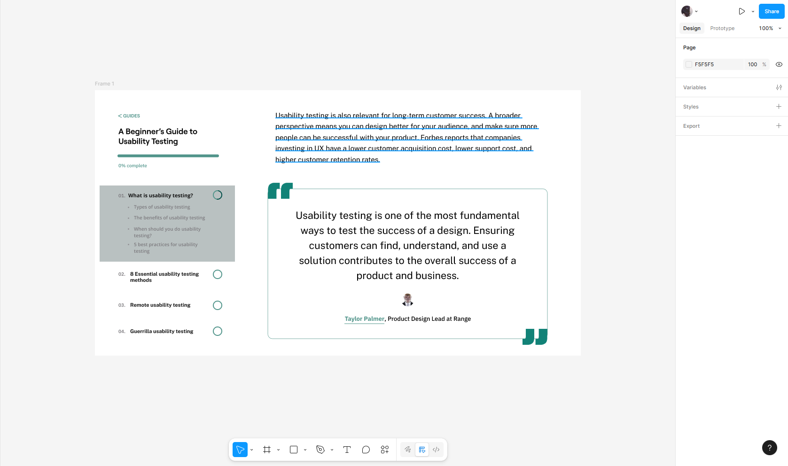

# **ПРАКТИЧНА РОБОТА №7-8**

## **Тема:Типографіка в дизайні інтерфейсів**

### Завдання:
#### *1. Опрацьовано теоретичний матеріал із Google-документу*
#### *2. Вивчити основні принципи типографіки у UI/UX-дизайні*
#### *3. Виконати завдання із файлу*

### **Хід роботи:**
#### **Результат**

#### **Посилання на роботу:**
https://www.figma.com/design/Gcx2umswhZvAowFlxuLqak/Untitled?node-id=0-1&m=dev&t=YBKkJHYSoY0Hrcfh-1

## **ВИСНОВОК:**
Отже, на практичних завданнях я ознайомився з теоретичними відомостями про типографіку в дизайні та відтворив свої теоретичні навички на практиці.
