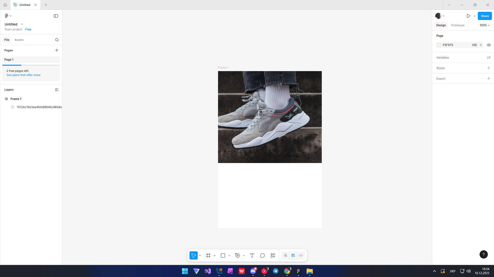
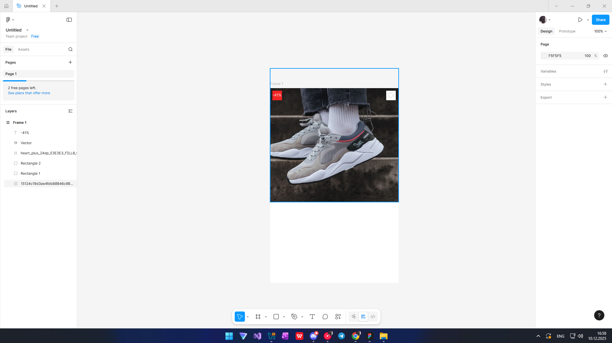
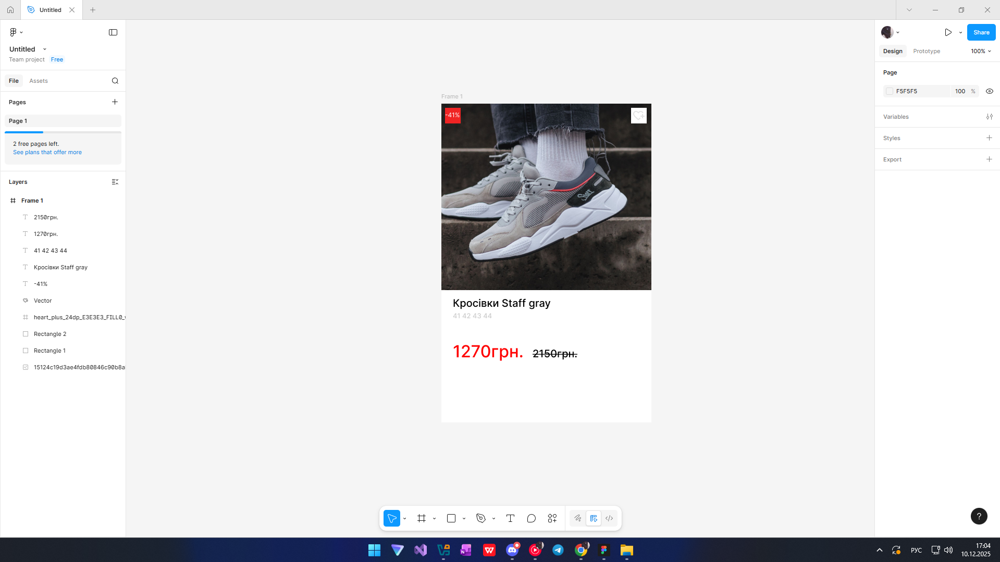
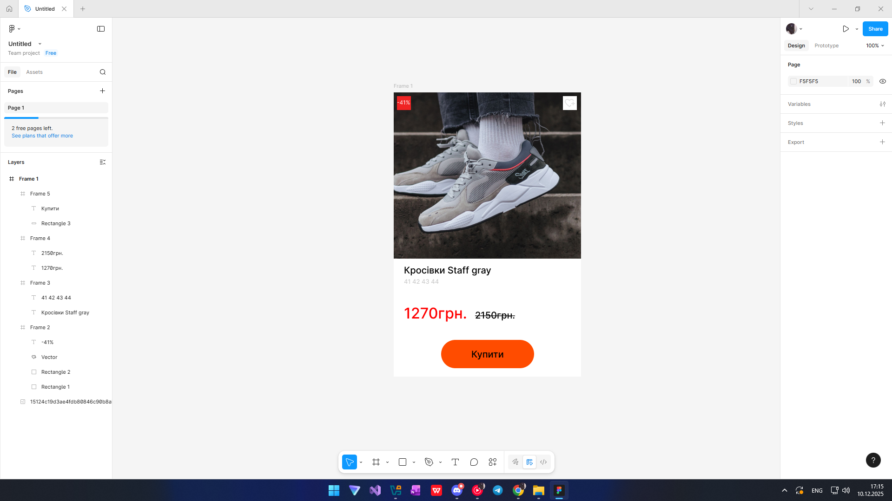

# **ПРАКТИЧНА РОБОТА №9**

## **Тема: Функція Auto layout у Figma. Створення картки товару (послуги).**

## **Мета: Ознайомитися з можливостями Auto layout у Figma та навчитися створювати зручні, адаптивні картки товарів або послуг із використанням цього інструмента. Закріпити навички роботи з іконками, зображеннями, текстом та компонентами.**

### Завдання:

#### **Створити картку товару, використовуючи функцію Auto layout у Figma. Під час оформлення застосувати відповідне зображення, текст, іконки та елементи керування (кнопки).**

### Хід роботи:

#### **1) Cтворюю фрейм і додаю фото товару, у моєму випадку це кросівки**

#### **2) Далі за допомогою фігур Figma та іконок створюю кнопку додати в бажане та інформаційне вікно про акцію на цей товар**

#### **3) Додаємо ціну та невеликий опис товару**

#### **4)останній крок це додавання кнопки "Купити" за допомогою Auto layout**

## **Результат роботи**
Нижче представлено створену мною у Figma товарну картку, оформлену за допомогою Auto Layout:

#### **Посилання на роботу:**
[Переглянути проєкт у Figma](https://www.figma.com/design/kNZsqXYuPSPWLnFxHRZr5M/Untitled?node-id=0-1&m=dev&t=FLxAoK26EQZELMUt-1)

## **ВИСНОВОК:**
Отже, у межах цієї практичної роботи я детально ознайомився з можливостями Auto Layout та зрозумів принципи його використання у Figma. Під час виконання завдання я не лише вивчив теоретичні аспекти роботи з автоматичним вирівнюванням елементів, але й застосував ці знання на практиці, створюючи та налаштовуючи картки товарів. Такий підхід дав змогу краще відчути логіку Auto Layout, навчитися правильно організовувати структуру інтерфейсу та ефективно працювати з адаптивними компонентами. У результаті я здобув корисний досвід, який зможу використовувати у майбутніх проєктах.

