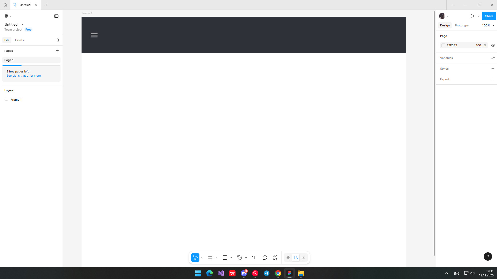
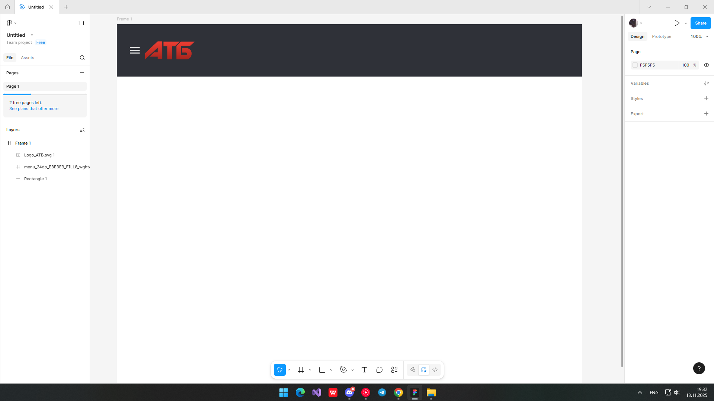
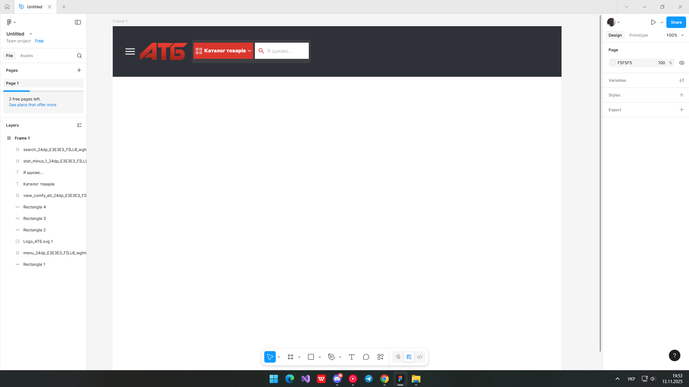
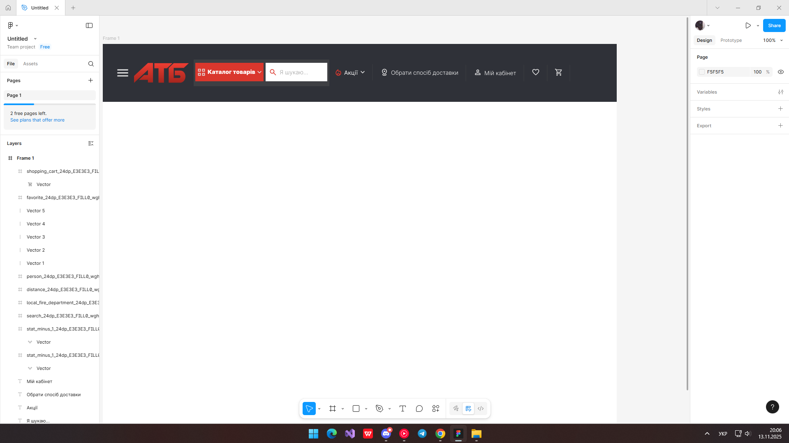
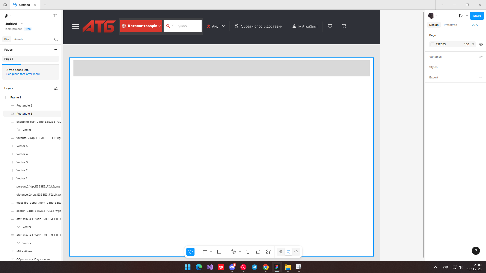
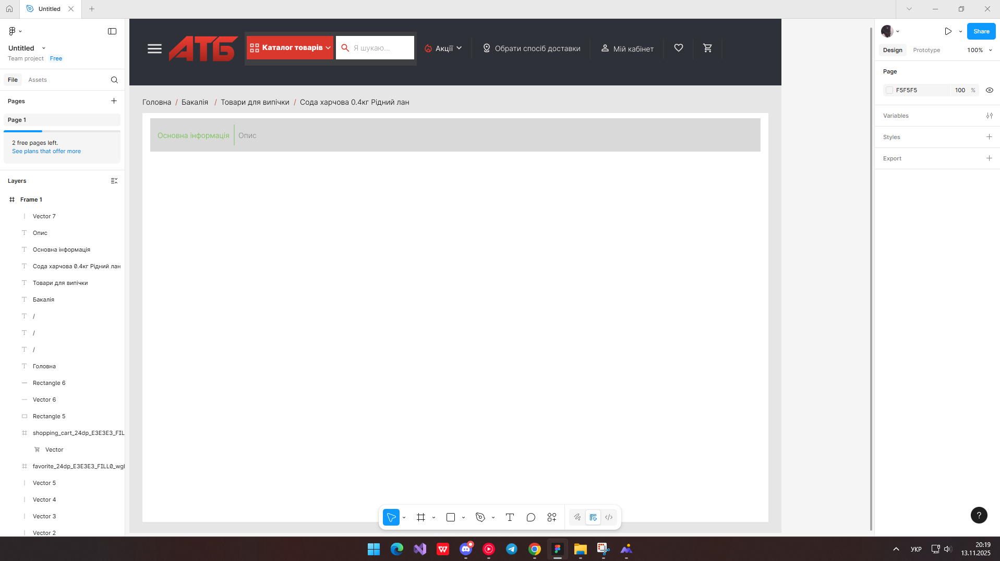
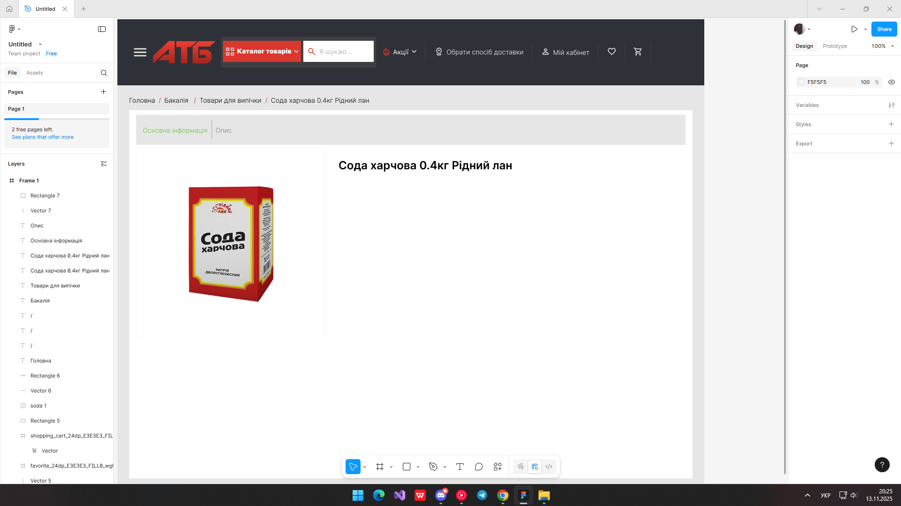
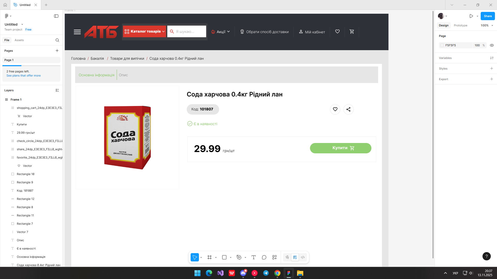
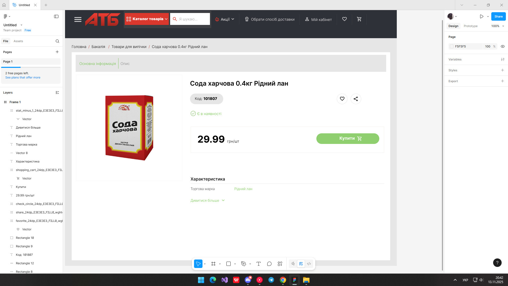

# **ПРАКТИЧНА РОБОТА №9**

## **Тема: Функція Auto layout у Figma. Створення картки товару (послуги).**

### Хід роботи:

## ***Спочатку створюю фрейм і додаю щось на кшталт хедера сайту, та додаю іконку меню***

#### **Далі вставляю логотип торгової мережі "АТБ"**

#### **Після цього за допомогою фігур Figma та іконок з розширенням SVG створюю пошуковий рядок та меню "Каталог товарів"**

#### **Наступний крок це створення розділів: акції, вибору доставки та особистого кабінету**

#### **На цьому кроці я починаю створювати саму сторінку товару**

#### **Тут додаю ієрархічну навігацію**

#### **Далі, на цьому кроці я вже добиваю фото самого продукту та його назву**

#### **Після цього я роблю досить об'ємну роботу і створюю відразу ціну, код товару, кнопки додати в бажане, поділиться, та купити**

#### **Завершую проект додаванням невеликою характеристикою товару**

#### **Посилання на роботу:**
https://www.figma.com/design/Dp0dtHBIWoW6kZmI5zn5bO/Untitled?node-id=0-1&p=f&t=mkuQYGnv7rhQq9sB-0

## **ВИСНОВОК:**
Отже, у межах цієї практичної роботи я детально ознайомився з можливостями Auto Layout та зрозумів принципи його використання у Figma. Під час виконання завдання я не лише вивчив теоретичні аспекти роботи з автоматичним вирівнюванням елементів, але й застосував ці знання на практиці, створюючи та налаштовуючи картки товарів. Такий підхід дав змогу краще відчути логіку Auto Layout, навчитися правильно організовувати структуру інтерфейсу та ефективно працювати з адаптивними компонентами. У результаті я здобув корисний досвід, який зможу використовувати у майбутніх проєктах.

