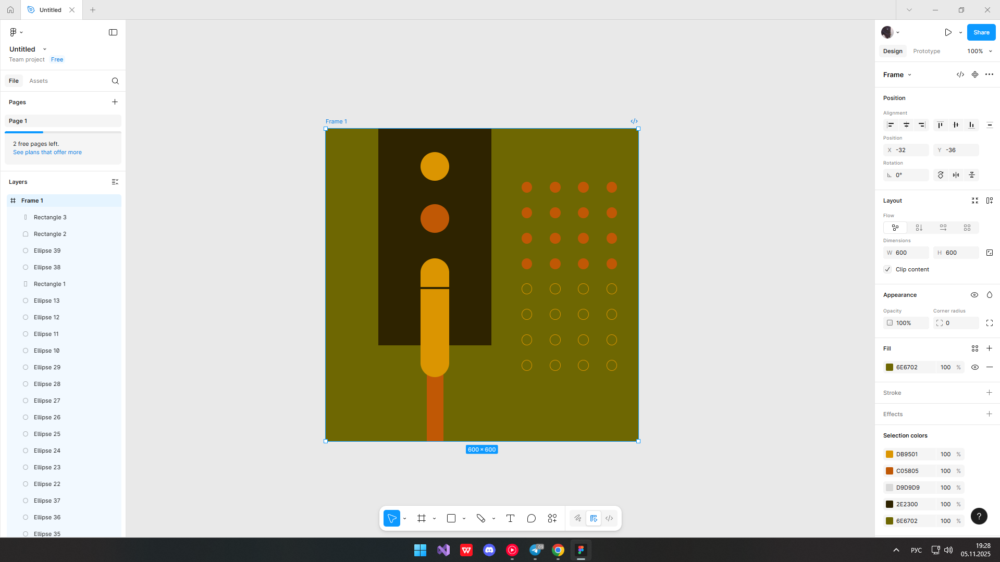

ПРАКТИЧНА РОБОТА №3
Тема:  Робота з простими формами та їх властивостями у Figma. Створення геометричного візерунку.Частина 2
Хід роботи:
1.  Результат

ВИСНОВОК:
Отже, на цій практичній роботі я продовжив вивчати прості фігури та навчився робити складні візерунки(патерни)
