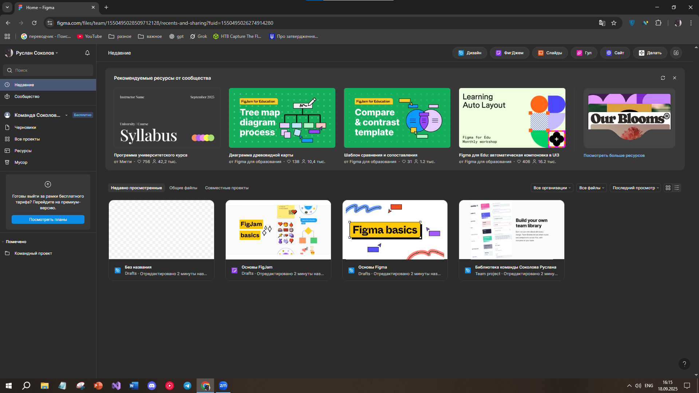

@@ -1 +1,16 @@
# **ПРАКТИЧНА РОБОТА №1**

## **Тема: Огляд сервісів для прототипування**

### Хід роботи:

#### **1. Зареєстрований аккаунт та інтерфейс Figma (веб версія):**

#### **2. Інтерфейс Figma (веб версія):**

## **ВИСНОВОК:**
Отже на цій практичній роботі я навчився оформлювати структури у GitHub, створив аккаунт та ознайомився з інтерфейсом у Figma. 

  
