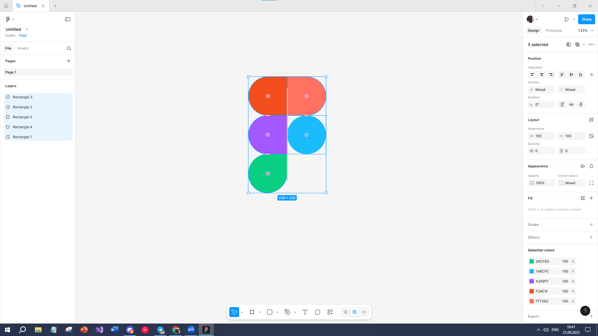

@@ -1 +1,16 @@
# **ПРАКТИЧНА РОБОТА №2**

## **Тема: Робота з простими формами та їх властивостями у Figma. Частина 1**

### **Завданя:**
#### **Використовуючи просту форму (shape tool)  Rectangle,  створити  зображення за зразком.**

### **Хід роботи:**

#### **1. Результат роботи:**

## **ВИСНОВОК:**
Отже на цій практичній роботі я навчився створювати прості форми та редагувати їх властивості у Figma. 
